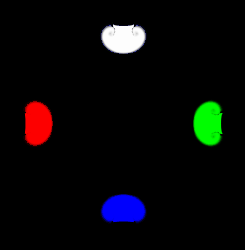
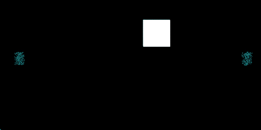
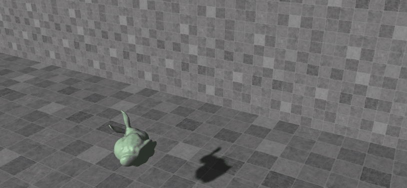
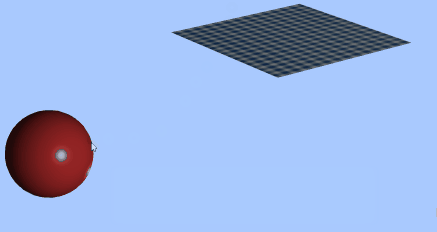
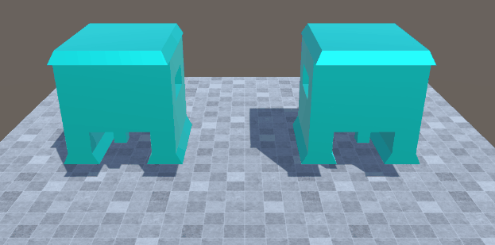
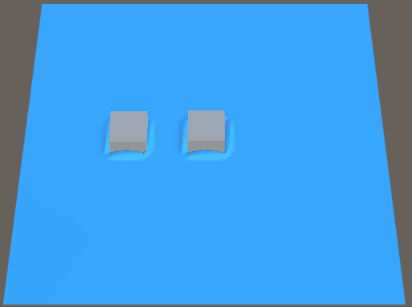

# simswitch

## Course Notes

Rigid Body Notes: [https://blog.sigfeng.com/2023/08/24/inertia](https://blog.sigfeng.com/2023/08/24/inertia)

MPM Course Notes: [https://blog.sigfeng.com/2023/09/12/mpm](https://blog.sigfeng.com/2023/09/12/mpm)

Projective Dynamics Notes: [https://blog.sigfeng.com/2023/10/13/projective-dynamics](https://blog.sigfeng.com/2023/10/13/projective-dynamics)

Deformable Notes: (coming...)

## GAMES 201 (may take several seconds to load GIF)

+ Stable fluid

  

+ PIC/FLIP/PIC-FLIP/APIC

  

+ MPM-rigid two-way coupling

  

## GAMES 103 (may take several seconds to load GIF)

+ Rigid body dynamics

  

+ Cloth simulation

  

+ Elastic Body FEM (Neo-hookean and StVk)

  

+ Shallow wave

  

